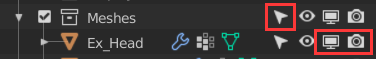
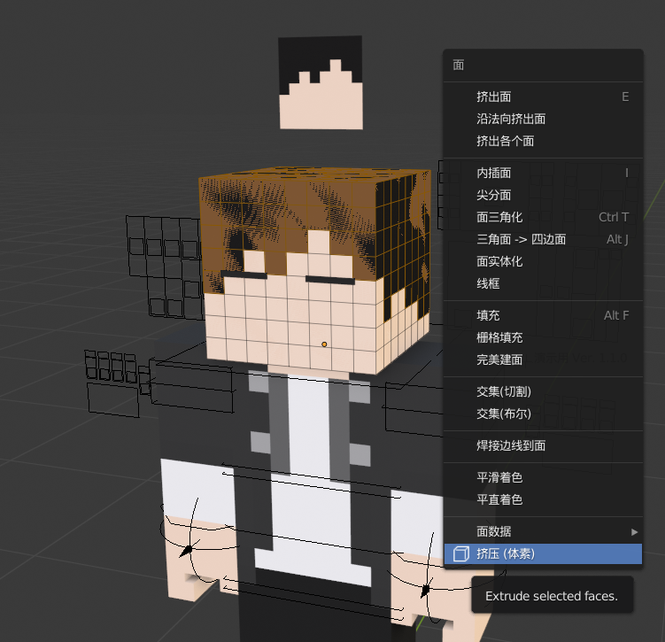
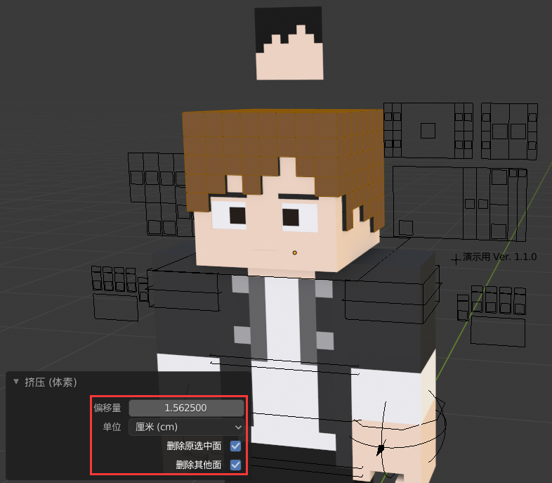
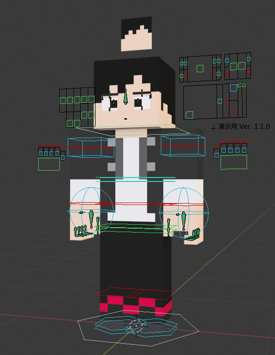

# Extras - 附加功能

``` eval_rst
.. warning::
   尚未完工。一些内容已过时。
```

## 人模挤压

* 人模UV已经处理完毕，可直接进行挤压操作。
* 挤压头部时需要先开启“Ex_Head”的视图显示（如图）。
* 附赠经过优化的挤压脚本（[下载地址](download)），处理更加方便。
* 更多说明，参见[这里](https://www.bilibili.com/video/av85835353)。







## 手指及控制器（v1.3.0）

* 新旧手指方案共存。

``` eval_rst
+------------------------------------+------------------------------------+
| 旧版手指                           | 新版手指                           |
+====================================+====================================+
| .. image:: images/ex/fingers/0.png |                                    |
+------------------------------------+------------------------------------+
| .. image:: images/ex/fingers/1.png | .. image:: images/ex/fingers/2.png |
+------------------------------------+------------------------------------+
```

## 绑定手持物（v1.3.0+）

* 该方案现可适用于任何情况。
* 导入物品，移动到手臂处（箭头）。
* 按住`Shift`并选择箭头，然后绑定父级（`Ctrl+P`）。

## 额外控制器

* 不推荐，仅用于特殊需求。
* 无法保证是否会出现bug。


