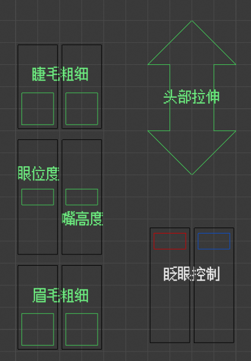

# Getting Started - 开始使用

```eval_rst
.. warning::
   尚未完工。请阅读压缩包内自带文档。
```

## 导入

* 左上角“文件-追加（Append）”，找到*.blend文件并选择。

* 找到“Collection-Varcade_BL_v1.3.3”，选择并导入。

* 请不要按照某些教程直接导入全部Objects！

* 导入完成后，先点一次人模骨架然后再进行移动！

## 面板功能（v1.3.0）

* 与C4D面板功能基本一致，如已熟悉可跳过。





## 材质修改

* 物体模式下选择“Material”（材质）。

* 切换到“属性-材质”界面，即可对所有材质进行修改。

* 材质在“实体”模式下的颜色与材质本身颜色可能会有差异，还请注意。

* 也可以点击上方“Shading”修改材质节点，但谨慎修改带有驱动器的“口腔-2”。


### 皮肤文件修改


* 你懂的。

### 新眼睛材质（v1.3.3+）

**Custom V2.5（默认）**


* 具体效果还请自行尝试。
