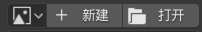

# Getting Started - 开始使用

## 导入

* 左上角“文件-追加（Append）”，找到*.blend文件并选择。

* 找到“Collection-Varcade_BL_v1.3.5”，选择并导入。

* 请不要按照某些教程直接导入全部Objects！

* 导入完成后，先点一次人模骨架然后再进行移动！

## 面板（v1.3.0）

* 与C4D面板功能基本一致，如已熟悉可跳过。

``` eval_rst
+-------------------------------+-------------------------------+
| .. image:: images/panel/0.png                                 |
+-------------------------------+-------------------------------+
| .. image:: images/panel/1.png | .. image:: images/panel/2.png |
+-------------------------------+-------------------------------+
```

## 材质修改

* 物体模式下选择“Material”（材质）。

* 切换到“属性-材质”界面，即可对所有材质进行修改。

* 材质在“实体”模式下的颜色与材质本身颜色可能会有差异，还请注意。

* 也可以点击上方“Shading”修改材质节点，但谨慎修改带有驱动器的“口腔-2”。


``` eval_rst
=============================== ===============================
原文                            翻译
=============================== ===============================
.. image:: images/texture/1.png .. image:: images/texture/2.png
=============================== ===============================
```

### 皮肤文件修改




* 你懂的。

### 新眼睛材质（v1.3.3+）

**Custom V2.5（默认）**

``` eval_rst
=========================== ===========================
参数                        输出材质
=========================== ===========================
.. image:: images/eye/0.png .. image:: images/eye/1.png
=========================== ===========================
```

* 具体效果还请自行尝试。

**Custom V1**

* 需自行连接节点组。

``` eval_rst
=========================== ===========================
节点                        输出材质
=========================== ===========================
.. image:: images/eye/2.png .. image:: images/eye/3.png
=========================== ===========================
```

**Separate Colors**

* 可与“Custom V1”混用，也可与“Custom V2”的“外向”、“向内”混用。

``` eval_rst
=========================== ===========================
节点 / 节点组合             输出材质
=========================== ===========================
.. image:: images/eye/4.png .. image:: images/eye/5.png
.. image:: images/eye/6.png .. image:: images/eye/7.png
.. image:: images/eye/8.png .. image:: images/eye/9.png
=========================== ===========================
```

## 自定义属性

* 整体属性：选择人模，在“属性-物体”界面中即可找到。
* 局部属性：选择特定控制器，在“属性-骨骼”界面中即可找到。
* 推荐调出右侧菜单（N）控制自定义属性。

``` eval_rst
.. note::
   “*boolean*”表示当值为0时不开启此功能（相当于False）；为1时开启此功能（相当于True）。
```

### 整体属性


| 属性 | 描述 | 值 |
| ---- | ---- | -- |
| Extra Controllers | 显示额外控制器<br />与面板控制器共存 | *boolean* |
| Model Type | 模型类型 | 0 - Steve模型（粗）<br />1 - Alex模型（细） |
| Show Second Layer | 显示第二层<br />会影响渲染结果 | *boolean* |

### 局部属性 – 眼珠（v1.3.1+）


| 属性 | 描述 | 值 |
| ---- | ---- | -- |
| Double-lattice Eyes | 开启双格眼<br />根据皮肤类型设置 | *boolean* |
| Eye Type | 眼睛类型 | 0 - 默认<br />1 - “> <”型眼<br />2 - “X X”型眼<br />3 - 取消眼白（“\| \|”型眼）<br />4 - 隐藏双眼 |
| Eyelashes (Main) | 开启眼睛上方的睫毛及控制器 | *boolean* |
| Eyelashes (Sub.) | 开启眼睛两侧的附属睫毛及控制器 | *boolean* |
| Screen Mode | 面部扁平化<br />取消下巴和口腔<br />看起来就像屏幕一样 | *boolean* |

``` eval_rst
.. note::
   因“分段移动”功能需要自动运行Python脚本，可能会导致出错，故删除该功能。
```

``` eval_rst
================================ ================================
Eyelashes = 0                    Eyelashes = 1
================================ ================================
.. image:: images/attr/eye/1.png .. image:: images/attr/eye/2.png
================================ ================================

================================ ================================
Screen Mode = 0                  Screen Mode = 1
================================ ================================
.. image:: images/attr/eye/3.png .. image:: images/attr/eye/4.png
================================ ================================
```

### 局部属性 – 嘴


| 属性 | 描述 | 值 |
| ---- | ---- | -- |
| Hide Mouth | 隐藏嘴部 | *boolean* |
| Mouth Type | 嘴部类型 | 0 - 默认<br />1 - 隐藏口腔并填充黑色（口腔-2），保留牙齿<br />2 - 隐藏口腔和牙齿 |

``` eval_rst
================================== ================================== ==================================
Mouth Type = 0                     Mouth Type = 1                     Mouth Type = 2
================================== ================================== ==================================
.. image:: images/attr/mouth/1.png .. image:: images/attr/mouth/2.png .. image:: images/attr/mouth/3.png
================================== ================================== ==================================
```

### 局部属性 – 两侧眉毛控制


| 属性 | 描述 | 值 |
| ---- | ---- | -- |
| Hide | 隐藏选定眉毛 | *boolean* |

``` eval_rst
+--------------------------------------+
| Screen Mode & Hide Mouth & Hide = 1  |
+======================================+
| .. image:: images/attr/eyebrow/1.png |
+--------------------------------------+
```

### 局部属性 – IK控制器（v1.3.3+）


| 属性 | 描述 | 值 |
| ---- | ---- | -- |
| Stretch | 当IK控制器距离太远时拉伸手臂/腿 | *boolean* |
| Fingers | 手指 | 0 - 关闭<br />1 - 开启，手掌朝向身体<br />2 - 开启，手掌朝向前方<br /> |
| Old Type | 启用旧版手指<br />当`Finger > 0`时该项有效 | *boolean* |
| Use FK | 使用FK控制器<br />并禁用对应IK控制器（但不隐藏） | *boolean* |
| Ground Fitting | 地面贴合，这不是弯曲 | *boolean* |
| Auto-bending | 脚腕自动弯曲<br />**开启时：**<br />禁用对应IK控制器<br />在脚后跟处显示新的球形控制器<br />新控制器操作与v1.3.0相同 | *boolean* |

``` eval_rst
.. attention::
   当Stretch为0时，Auto-bending必须设为0，否则会出现bug。
```

``` eval_rst
=============================== ===============================
Fingers = 1                     Use FK = 1
=============================== ===============================
.. image:: images/attr/ik/2.png .. image:: images/attr/ik/3.png
=============================== ===============================

+---------------------------------+---------------------------------+
| Auto-bending = 1                                                  |
+=================================+=================================+
| .. image:: images/attr/ik/4.png | .. image:: images/attr/ik/5.png |
+---------------------------------+---------------------------+++---+
```
